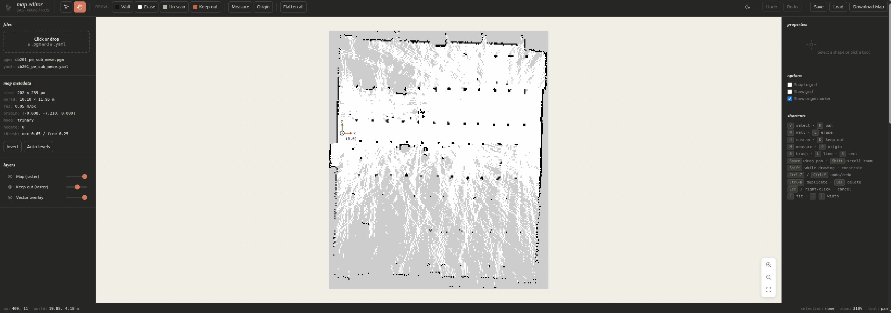
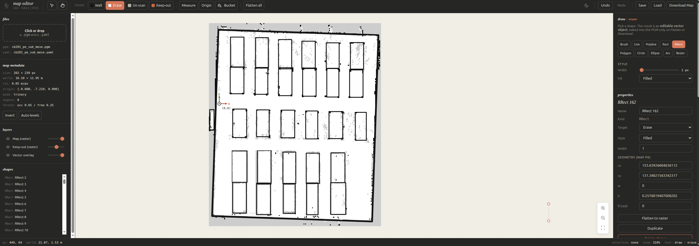
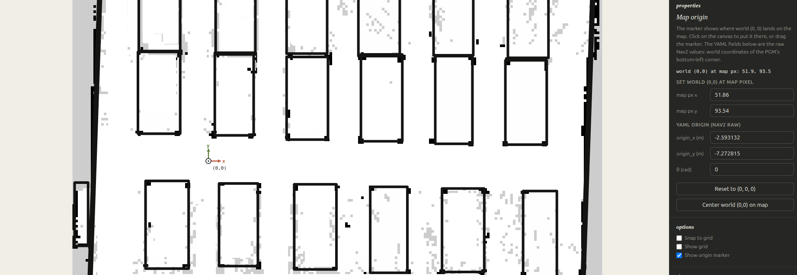

<h1 align="center">sas-map-editor</h1>


<p align="center">
  
</p>

A lightweight, dependency-free editor for ROS occupancy grid maps. Built for Nav2 navigation pipelines that occasionally need a clean way to fix noisy SLAM output, add a missing wall, mark a keep-out zone, or set a meaningful world origin, without leaving the browser and without committing irreversible changes to a raster file.

Every drawing operation is a non-destructive vector object. Walls, erasures, un-scanned regions and keep-out zones are all editable shapes that stay editable until you explicitly flatten them or export. The original PGM is touched only on export.

Everything runs locally in the browser. No server, no upload, no dependency to install.

**Live demo:** https://andrei-staicu.github.io/sas-map-editor/



## Why

ROS map editors like `map_editor` or the GyroPalm ROS SLAM Map Editor commit your changes to pixels the moment you draw. Drew a wall too long? You can undo immediately, otherwise it is part of the raster forever. Need to move a wall by 20 cm? Erase, redraw, hope you got the alignment right.

This editor keeps every shape you draw as a vector object on top of the raster. You can move, resize, rotate, duplicate or delete any shape at any point. The PGM stays untouched until you flatten or export. If you save the session as a project file, you can come back days later and continue editing the same shapes.

## Features

- **Non-destructive vector editing.** Every wall, erase, un-scan or keep-out is a vector shape, editable until you flatten or download.
- **Ten shape primitives.** Brush, line, polyline, rectangle, rotated rectangle, polygon, circle, ellipse, arc, bezier curve.
- **Four target channels.** Wall, Erase, Un-scan (writes to map raster), Keep-out (writes to a separate mask raster compatible with the Nav2 keep-out filter).
- **Bucket fill.** Flood-fill any enclosed region with the current target. Vector shapes act as barriers, so you can fill the interior of a Wall outline with Erase to clear a room in one click.
- **Editable map origin.** Place world (0, 0) anywhere on the map by click, drag, pixel input, or raw YAML coordinates. Off-canvas marker is indicated by an edge chevron.
- **Round-trip projects.** Save the entire editing session as `.sasmap.json` and resume later with shapes, origin, layers and history intact.
- **Live distance measurement** in meters, feet and pixels.
- **Metric snap-to-grid** in user-defined steps.
- **Fifty step undo/redo.**
- **Dark and light themes.** Toggled in the topbar, persisted in localStorage.

## Quick start

Open the editor, drop a `.pgm` and a `.yaml` file anywhere on the canvas (or use the panel on the left), and start editing.

```
1. Drag your .pgm and .yaml onto the canvas.
2. Click "Wall" in the topbar, choose "Brush" in the right panel.
3. Paint over the noise in your SLAM map.
4. Switch to "Origin" tool, click on the map where you want world (0, 0).
5. Click "Download Map".
6. Use the resulting <name>_edited.pgm + .yaml in your Nav2 launch file.
```

## Workflow example

### 1. Loading a map

Drop the `.pgm` and `.yaml` together. The editor parses both natively, respecting standard ROS conventions (resolution in m/px, origin as world coordinates of the bottom-left corner, bottom-left image anchoring). The metadata appears in the left panel.


### 2. Drawing shapes

Pick a target (Wall, Erase, Un-scan, Keep-out) from the topbar. The shape will rasterize in that channel with that target's color. Pick a primitive from the right panel (brush, line, rect, polygon, etc.) and draw on the canvas. Every shape is added to the Shapes list in the left panel and stays editable.



Hold Shift while drawing to constrain angles to 0, 45 or 90 degrees. Right-click cancels the current operation, like Escape. Polylines and polygons end with right-click or by clicking the first point (polygon).

### 3. Setting the origin

Switch to the Origin tool. The marker shows where world (0, 0) lands on your map. Click anywhere to put it there, drag the marker for fine adjustment, or type the coordinates directly in the right panel. The marker shows red and green axes (x and y) for visual reference.



Useful when:
- Your SLAM map has the origin in the wrong corner.
- You want to align world (0, 0) with a meaningful landmark (a room corner, a charging station).
- You are stitching maps and need to harmonize origins.

### 4. Exporting

**Download Map** flattens all vector shapes onto the raster and downloads:
- `<name>_edited.pgm` and `<name>_edited.yaml`: the edited map, drop-in compatible with Nav2 `map_server`.
- `<name>_edited_keepout.pgm` and `.yaml` (if any keep-out content): drop-in compatible with the Nav2 keep-out filter.

**Save** generates `.sasmap.json`, the complete editing session (raster + mask + vector shapes + meta + layers). Use **Load** to resume later with everything intact. This is for your own workflow, not for Nav2.

## File formats

### Input

- **`.pgm`** (P5 binary or P2 ASCII, 8-bit or 16-bit).
- **`.yaml`** with standard Nav2 keys: `image`, `mode` (trinary / scale / raw), `resolution`, `origin` (inline list or block-style), `negate`, `occupied_thresh`, `free_thresh`.
- A keep-out raster pair (`*_keepout.pgm` + `*_keepout.yaml`) is detected by filename suffix and loaded into the mask layer.

### Output

- `<name>_edited.pgm` (P5 binary, 8-bit) + `<name>_edited.yaml`.
- `<name>_edited_keepout.pgm` + `<name>_edited_keepout.yaml` when keep-out content exists.

### Project format

`.sasmap.json` contains base64-encoded raster data plus the full vector layer. Versioned (`version: 1`). Designed to be forward-compatible.

## Keyboard shortcuts

| Key | Action |
|---|---|
| `V` | Select tool |
| `H` or `Space`+drag | Pan |
| `W` / `E` / `U` / `K` | Wall / Erase / Un-scan / Keep-out target |
| `M` | Measure |
| `O` | Origin tool |
| `G` | Bucket fill |
| `B` / `L` / `R` | Brush / Line / Rect kind |
| `[` / `]` | Decrease / increase shape width |
| `F` | Auto-fit |
| `Shift`+scroll | Zoom |
| `Shift` (while drawing) | Constrain to 0/45/90 |
| `Ctrl+Z` / `Ctrl+Y` | Undo / Redo |
| `Ctrl+A` | Select all shapes |
| `Ctrl+D` | Duplicate selection |
| `Ctrl+S` | Save project |
| `Del` | Delete selection |
| `Esc` or right-click | Cancel current operation |

## Running locally

This is a single HTML file with no build step.

```bash
git clone https://github.com/andrei-staicu/sas-map-editor.git
cd sas-map-editor
# Any static server works. Examples:
python3 -m http.server 8000
# or
npx serve .
```

Then open http://localhost:8000 in your browser. Modern Chrome, Firefox, Safari, or Edge.

You can also just open `index.html` directly with `file://`, but some browsers restrict drag-and-drop file API behavior on local files. A static server is recommended.

## Foundation

This editor is a tool built in support of the **Semantic Autonomy Stack (SAS)**, a layered architecture for mobile robot autonomy that combines geometric navigation with semantic memory and language-based reasoning.

SAS is the subject of two open-access publications:

- [MDPI Sensors, doi:10.3390/s26072232](https://www.mdpi.com/1424-8220/26/7/2232) — Angular Sector Fusion and semantic route planning for autonomous mobile robots.
- [arXiv:2605.02525](https://arxiv.org/abs/2605.02525) — Cross-robot semantic memory transfer experiments in the SAS framework.

## Companion tools

- [nav2-graph-editor](https://github.com/andrei-staicu/nav2-graph-editor) — annotate route graphs on top of ROS occupancy maps, GeoJSON output for Nav2 route servers.

## Author

**STAICU Andrei-Alexandru**, National University of Science and Technology Politehnica Bucharest, Faculty of Industrial Engineering and Robotics (FIIR).

Thesis coordinator: Conf. dr. ing. ABAZA Bogdan-Felician.

## License

MIT. See `LICENSE`.
